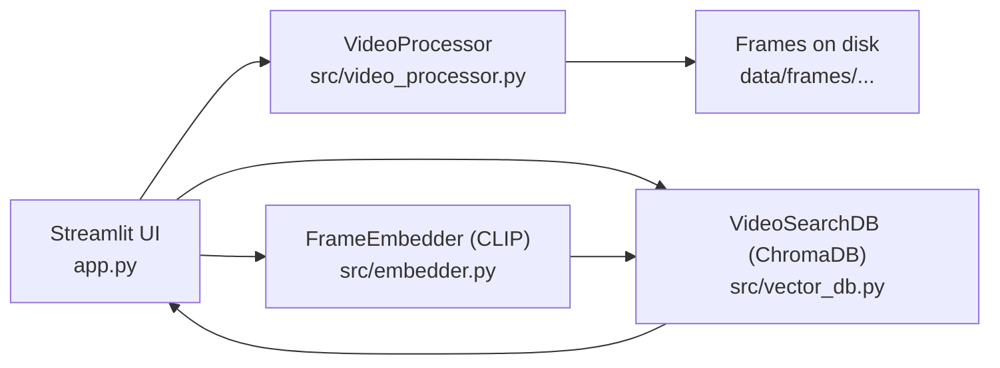
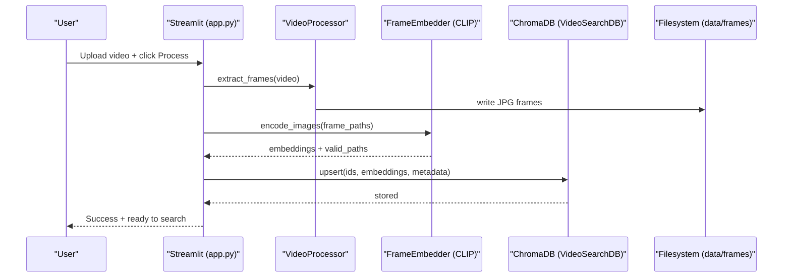
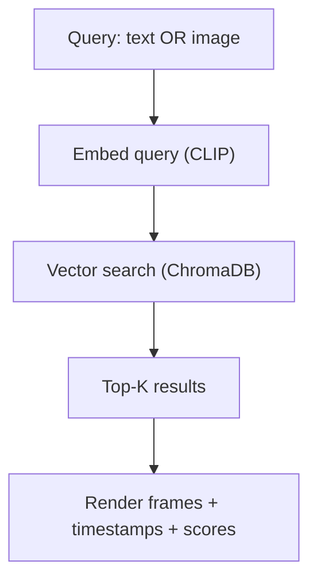

<h1 align="center">V-RAG — Video Semantic Search</h1>

<p align="center">
  CLIP-powered local video retrieval with Streamlit + ChromaDB
</p>

<p align="center">
  <a href="https://github.com/pypi-ahmad/v-rag-video-search/actions/workflows/ci.yml"></a>
  
  
  
</p>

<p align="center">
  
</p>

<p align="center">
  
  
  
</p>

Local, semantic video search: **upload a video → extract frames → embed with CLIP → store in ChromaDB → search by text or image**.

> This repository currently focuses on **retrieval/search**. A generation (LLM) layer can be added on top of retrieved frames.

🔗 **Repository:** https://github.com/pypi-ahmad/v-rag-video-search.git

### Quick links

- [What you can do](#-what-you-can-do)
- [Architecture](#-architecture)
- [Runtime flows](#-runtime-flows)
- [Quickstart](#-quickstart)
- [Configuration](#️-configuration)
- [Troubleshooting](#-troubleshooting)

### Feature highlights

| 🚀 Local-first | 🧠 Multimodal retrieval | ⚡ Production-ready UX | 🛡️ Safe indexing |
|---|---|---|---|
| Run fully on your machine with no cloud dependency. | Search with both text prompts and camera/image queries. | Streamlit UI, CI checks, and practical troubleshooting docs. | Idempotent upserts, stable paths, and temp-file cleanup built in. |

---

## ✨ What you can do

- **Index videos locally** (frame extraction + embeddings)
- **Search by text** ("a red car", "people walking", "night traffic")
- **Search by image/camera** (find visually similar frames)
- **Re-run indexing safely** (idempotent DB writes via upsert)
- **Stable local storage paths** (DB path doesn't depend on where you run the app)
- **Auto cleanup of temporary files** (staged uploads / query images)

> No hosted backend. No cloud required. Everything runs on your machine.

---

## 🧠 How it works

### High-level pipeline
1. **Video → frames** (e.g., ~1 FPS sampling)
2. **Frames → embeddings** using CLIP
3. **Embeddings → ChromaDB** (vector search index)
4. **Query (text or image) → embedding → nearest neighbors**
5. Show **matching frames + timestamps + score**

---

## 🧩 Architecture



---

## 🔁 Runtime flows

### 1) Ingestion (Upload → Index)



### 2) Search (Text/Image → Results)



---

## 📁 Project layout

```text
.
├── app.py                     # Streamlit UI entrypoint
├── main.py                    # Optional CLI/dev entrypoint
├── src/
│   ├── __init__.py
│   ├── video_processor.py     # Frame extraction
│   ├── embedder.py            # CLIP embedder (text + image)
│   └── vector_db.py           # ChromaDB wrapper (upsert + search)
├── data/
│   ├── videos/                # Optional: your raw videos (ignored by git)
│   └── frames/                # Generated frames (ignored by git)
├── video_db_storage/          # ChromaDB local storage (ignored by git)
├── tests/                     # Smoke tests
├── .github/workflows/ci.yml   # CI workflow
├── docs/                      # Audit + engineering docs
├── LICENSE
└── requirements.txt
```

---

## 🧰 Requirements

- **Python:** 3.10+ (tested in CI on 3.12)
- **OS:** Windows / macOS / Linux
- **GPU (optional):** CUDA-capable GPU for faster embedding; CPU mode is supported

---

## ⚙️ Configuration

Current defaults and where to change them:

- **Frame sampling interval:** `1` second in `VideoProcessor.extract_frames(..., interval=1)`
  - Called from `app.py` via `processor.extract_frames(video_path, output_folder, interval=1)`
- **Top-K results:** `Max Results` slider, default `6` (range `1..20`)
- **Score threshold:** `Sensitivity Threshold` slider, default `160.0` (range `100.0..200.0`)
- **Storage paths:**
  - Frames: `data/frames/<video_name>/...`
  - Vector DB: `video_db_storage/`
  - Temp artifacts: `temp_uploads/`, `temp_query.jpg`

---

## ⚡ Quickstart

### 1) Clone

```bash
git clone https://github.com/pypi-ahmad/v-rag-video-search.git
cd v-rag-video-search
```

### 2) Create a virtual environment

**Windows (PowerShell)**

```bash
python -m venv .venv
.venv\Scripts\Activate.ps1
```

**macOS/Linux**

```bash
python -m venv .venv
source .venv/bin/activate
```

### 3) Install dependencies

```bash
pip install -r requirements.txt
```

### 4) Run the app

```bash
streamlit run app.py
```

---

## ✅ Usage

### Index a video

1. Open the Streamlit UI
2. Upload a video file
3. Click **Process & Index Video**
4. Wait for extraction + embedding + DB upsert

**Generated data**

* Frames are written to: `data/frames/<video_name>/...`
* Vector DB lives in: `video_db_storage/`

### Search by text

* Type a query like:

  * `"traffic at night"`
  * `"a person walking"`
  * `"red car"`
* Adjust:

  * **Top-K** results
  * **Score threshold**

### Search by image/camera

* Use the camera input (or image input if supported)
* The app embeds the query image and retrieves nearest frames
* Temporary query images are cleaned up automatically

---

## 🧹 Reset / cleanup

If you want a fresh start:

```bash
# remove generated frames + vector DB
rm -rf data/frames video_db_storage temp_uploads
```

(Windows PowerShell)

```powershell
Remove-Item -Recurse -Force data\frames, video_db_storage, temp_uploads
```

---

## 🛠 Troubleshooting

### OpenCV / video decode issues

* Try a smaller MP4
* Ensure `opencv-python` is installed via `requirements.txt`

### Slow indexing

* Indexing speed depends on:

  * video length
  * frame sampling frequency
  * CPU/GPU availability for embeddings

### "No results" or low match quality

* Try broader text prompts
* Reduce threshold / increase Top-K
* Use an image query closer to your target scene

---

## 🎬 Demo

Add one screenshot or GIF showing indexing and search results.

- Suggested files:
  - `docs/demo/ui-screenshot.png`
  - `docs/demo/search-example.gif`

---

## ⚠️ Limitations

- Retrieval-only pipeline (no built-in LLM generation stage)
- Fixed-interval frame sampling may miss short events
- Local-only indexing and storage (no multi-user backend)

---

## 🧭 Roadmap ideas (optional)

* Multi-video library view + per-video filters
* Jump-to-timestamp video playback
* Scene-change/keyframe sampling instead of fixed FPS
* Audio transcript search (speech-to-text) + hybrid retrieval

---

## 🤝 Contributing

PRs and issues welcome:

* Bug reports: include OS + Python version + a minimal repro video/query
* Feature requests: include a concrete workflow and expected UX

---

## 🙌 Acknowledgements

- OpenAI CLIP via `sentence-transformers`
- ChromaDB for local vector search
- Streamlit for the UI

---

## 📄 License

MIT — see [LICENSE](LICENSE).

---

**Author:** Ahmad Mujtaba
*Built as a Portfolio Project demonstrating Multimodal AI & Vector Search.*
