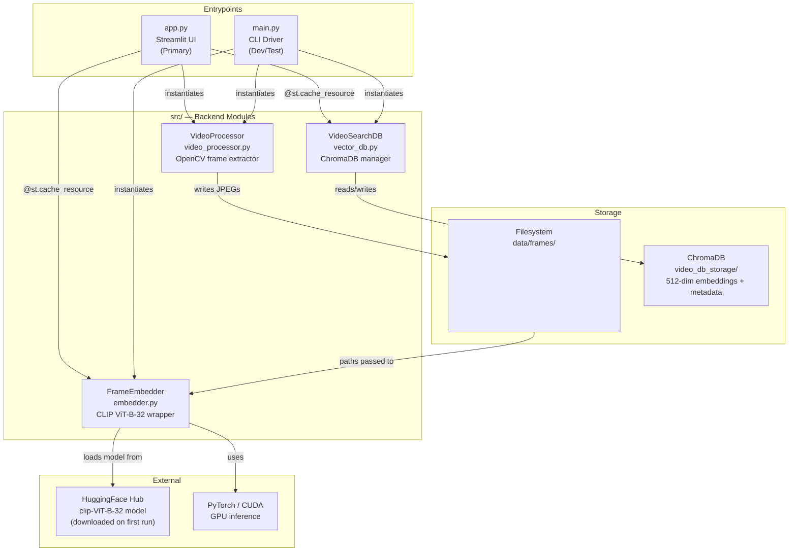

# V-RAG: Architecture

> All claims are backed by code evidence (file:line ranges).

---

## Component Overview

The system has **three backend modules** (in `src/`) orchestrated by **two frontends** (`app.py` and `main.py`), backed by **two storage layers** (filesystem frames + ChromaDB).

```
Evidence: src/ directory + app.py:L1–L14 + main.py:L1–L6
```

---

## Component Diagram



---

## Module Responsibilities

### `app.py` — Streamlit UI Controller

**Evidence:** `app.py:L1–L233`

| Function | Lines | Purpose |
|---|---|---|
| `get_embedder()` | L30–L31 | Cached factory for `FrameEmbedder` |
| `get_db()` | L34–L35 | Cached factory for `VideoSearchDB` |
| `format_timestamp(seconds)` | L38–L39 | Human-readable mm:ss string |
| `interpret_score(score)` | L41–L44` | Converts L2 distance to confidence label |
| `save_uploaded_file(uploaded_file)` | L46–L58 | Saves Streamlit upload buffer to `temp_uploads/` |
| `process_video_pipeline(video_path)` | L60–L104 | Orchestrates full Extract → Embed → Index pipeline |
| `main()` | L107–L161 | Renders sidebar + tabs UI |
| `perform_search(query_input, k, threshold, mode)` | L163–L217 | Handles text/image query, calls embedder + DB, renders results |

**Caching strategy:**
- `FrameEmbedder` and `VideoSearchDB` use `@st.cache_resource` — loaded once per Streamlit server process — `app.py:L30–L35`
- `VideoProcessor` is instantiated fresh per pipeline call (no caching) — `app.py:L73`

---

### `src/embedder.py` — CLIP Model Wrapper

**Evidence:** `embedder.py:L1–L90`

| Method | Lines | Purpose |
|---|---|---|
| `__init__(model_name)` | L12–L27 | Loads `clip-ViT-B-32` via `sentence-transformers`, detects GPU/CPU |
| `encode_images(image_paths, batch_size)` | L29–L85 | Batched PIL image → `Tuple[np.ndarray, List[str]]` (embeddings + valid paths) |
| `encode_text(text)` | L87–L90 | Text string → 512-dim numpy array |

**Key design decisions:**
- Accepts file paths, not PIL objects (forces disk I/O per batch) — `embedder.py:L56`
- Failed images are skipped and excluded from both the embedding array and the returned `valid_paths` list — `embedder.py:L57–63`
- Returns `np.empty((0, 512), dtype=np.float32), []` if all images fail — `embedder.py:L84`
- Uses `logging` module for warnings/errors — `embedder.py:L9`

---

### `src/vector_db.py` — ChromaDB Manager

**Evidence:** `vector_db.py:L1–L72`

| Method | Lines | Purpose |
|---|---|---|
| `__init__(collection_name)` | L13–L27 | Creates/connects to persistent ChromaDB using `__file__`-relative path, gets or creates collection |
| `add_frames(embeddings, metadata)` | L29–L56 | Validates input (empty guard + length check), upserts embeddings + metadata |
| `search(query_embedding, k)` | L58–L72 | ANN search, returns top-k results as list of dicts |

**Key design decisions:**
- DB path: `pathlib.Path(__file__).resolve().parent.parent / "video_db_storage"` — stable across CWD changes — `vector_db.py:L14,L22`
- IDs are JPEG basenames e.g. `frame_14000.jpg` — `vector_db.py:L46`
- ChromaDB uses its **default distance metric** (L2) — not explicitly configured — `vector_db.py:L26`
- Uses `collection.upsert()` for idempotent writes — `vector_db.py:L52`
- Raises `ValueError` if `len(embeddings) != len(metadata)` — `vector_db.py:L38–L41`
- No-ops with a warning if called with 0 embeddings — `vector_db.py:L34–L36`
- Uses `logging` module — `vector_db.py:L8`

---

### `src/video_processor.py` — Frame Extractor

**Evidence:** `video_processor.py:L1–L83`

| Method | Lines | Purpose |
|---|---|---|
| `__init__()` | L6–L7 | No-op constructor |
| `extract_frames(video_path, output_folder, interval)` | L9–L83 | Extracts 1 frame per `interval` seconds, saves JPEGs, returns metadata list |

**Key design decisions:**
- Resize: max height 640px, aspect-ratio-preserving, only if frame exceeds 640px — `video_processor.py:L51–L60`
- FPS fallback to 30.0 if `cv2.CAP_PROP_FPS <= 0` — `video_processor.py:L27–L29`
- Timestamp fallback for codecs that return 0 for `CAP_PROP_POS_MSEC` — `video_processor.py:L42–L45`
- `cap.release()` guaranteed via `finally` — `video_processor.py:L78`

---

## Data Lifecycle


---

## Dependency Graph

```
app.py
├── streamlit
├── torch
├── PIL (pillow)
├── cv2 (opencv-python)
├── src.embedder → sentence-transformers, torch, PIL, numpy, tqdm
├── src.vector_db → chromadb, numpy
└── src.video_processor → cv2, math

main.py
├── src.video_processor
├── src.embedder
└── src.vector_db
```

---

## Technology Choices

| Technology | Version/Model | Reason | Evidence |
|---|---|---|---|
| CLIP ViT-B-32 | via `sentence-transformers` | Multimodal text+image embedding in shared 512-dim space | `embedder.py:L12`, `README.md` |
| ChromaDB | PersistentClient | Embedded vector DB; no external server needed | `vector_db.py:L8–L15` |
| OpenCV | `opencv-python` | Efficient video frame extraction | `video_processor.py:L1` |
| Streamlit | Latest | Rapid UI with minimal frontend code | `app.py:L1` |
| PyTorch | cu130 wheel | GPU acceleration for CLIP inference | `requirements.txt:L1–L3` |
| Python | 3.13 (bytecache) | Inferred from `__pycache__` filenames (`cpython-313`) | `src/__pycache__/*.pyc` |
