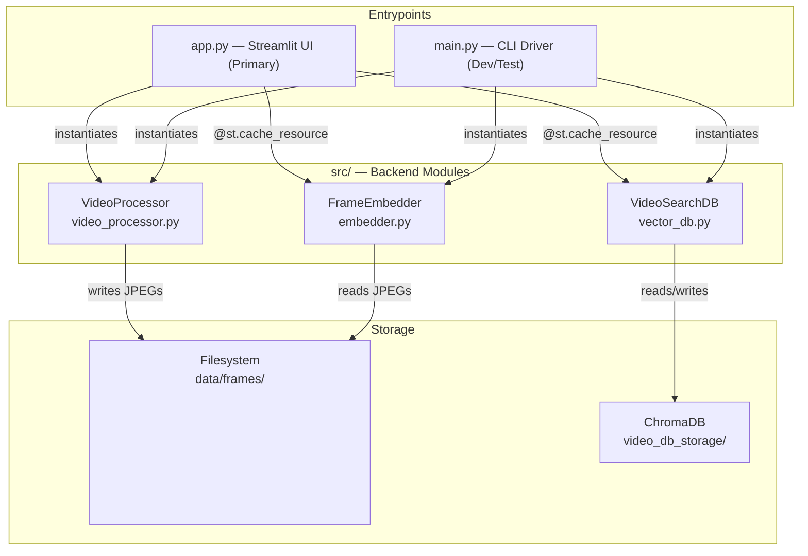

# V-RAG: Architecture

> All claims backed by code evidence (`file:line`).

---

## Component Overview

Three backend modules in `src/`, orchestrated by two frontends (`app.py`, `main.py`), backed by two storage layers (filesystem frames + ChromaDB).

---

## Component Diagram



---

## Module Details

### `app.py` (252 lines)

| Function | Lines | Purpose |
|---|---|---|
| `get_embedder()` | L37–L39 | `@st.cache_resource` factory |
| `get_db()` | L41–L43 | `@st.cache_resource` factory |
| `format_timestamp(s)` | L46–L47 | MM:SS string |
| `interpret_score(score)` | L49–L51 | L2 distance → confidence label |
| `save_uploaded_file(f)` | L53–L73 | Sanitized save to `temp_uploads/` (`__file__`-relative) |
| `process_video_pipeline(path)` | L75–L128 | Extract → Embed → Index |
| `main()` | L131–L166 | Sidebar + tabs UI |
| `perform_search(…)` | L168–L240 | Text/image query → DB search → grid render |

### `src/embedder.py` (90 lines)

| Method | Lines | Signature | Returns |
|---|---|---|---|
| `__init__` | L12–L27 | `(model_name='clip-ViT-B-32')` | — |
| `encode_images` | L29–L87 | `(paths, batch_size) -> Tuple[ndarray, List[str]]` | `(N,512)` + valid paths |
| `encode_text` | L89–L93 | `(text) -> ndarray` | `(512,)` |

### `src/vector_db.py` (76 lines)

| Method | Lines | Signature |
|---|---|---|
| `__init__` | L13–L26 | `(collection_name='video_frames')` |
| `add_frames` | L28–L55 | `(embeddings, metadata)` — upsert, raises `ValueError` on mismatch |
| `search` | L57–L76 | `(query_embedding, k=5) -> List[Dict]` |

### `src/video_processor.py` (93 lines)

| Method | Lines | Signature |
|---|---|---|
| `__init__` | L9–L10 | `()` — no-op |
| `extract_frames` | L12–L93 | `(video_path, output_folder, interval=1) -> List[Dict]` |

---

## Dependency Graph

```
app.py
├── streamlit, torch, PIL, cv2, time, shutil, pathlib, logging
├── src.embedder → sentence-transformers, torch, PIL, numpy, tqdm, logging
├── src.vector_db → chromadb, numpy, pathlib, logging
└── src.video_processor → cv2, logging, math, os

main.py
├── logging, os, glob
├── src.embedder
├── src.vector_db
└── src.video_processor
```

---

## Technology Choices

| Technology | Reason | Evidence |
|---|---|---|
| CLIP ViT-B-32 | Multimodal 512-dim embeddings | `embedder.py:L12` |
| ChromaDB PersistentClient | Embedded vector DB, no server | `vector_db.py:L24` |
| OpenCV | Video decode + frame extraction | `video_processor.py:L1` |
| Streamlit | Rapid UI | `app.py:L1` |
| PyTorch cu130 | GPU acceleration | `requirements.txt:L1` |
