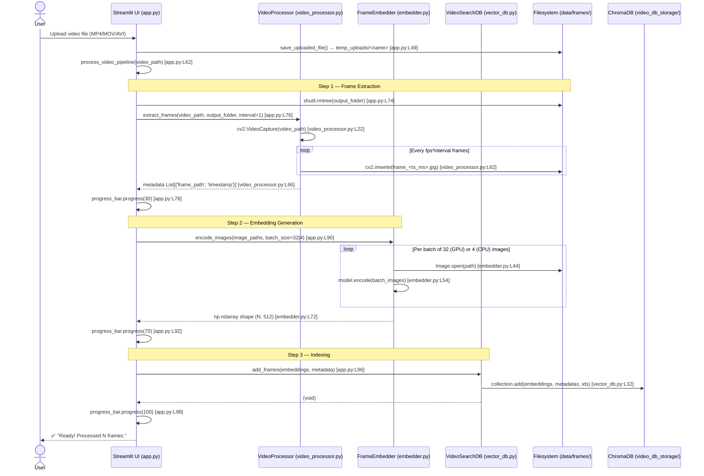
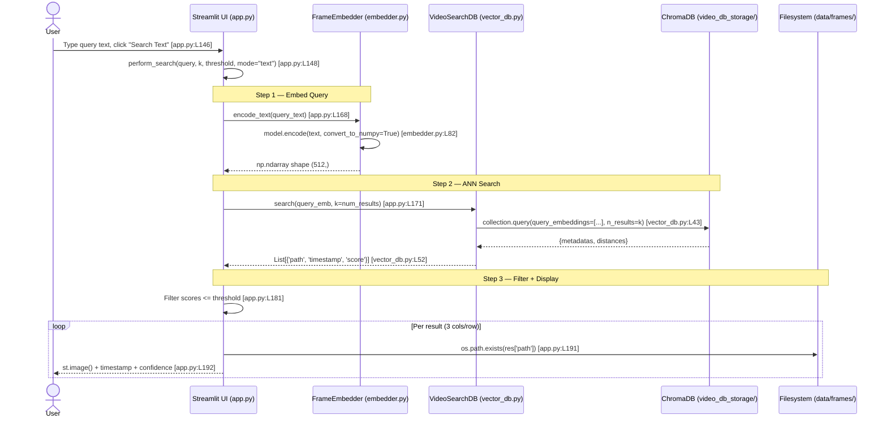
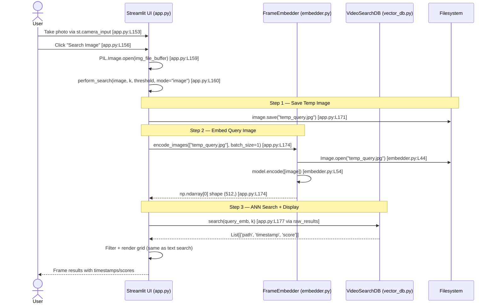
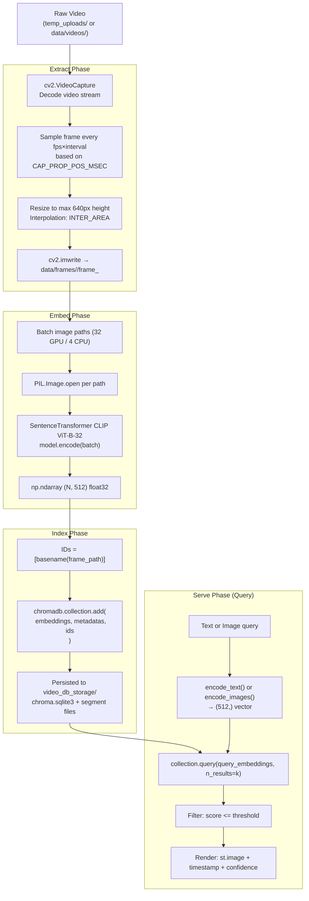

# V-RAG: Runtime Flows

> All flow steps are backed by evidence (file:line).

---

## 1. Ingestion Pipeline Flow

**Triggered by:** User clicks "🚀 Process & Index Video" after uploading a file.

**Evidence:** `app.py:L115–L120` (button), `app.py:L60–L104` (pipeline function)

### Sequence Diagram

---

## 2. Text Search Flow

**Triggered by:** User types a query and clicks "Search Text".

**Evidence:** `app.py:L146–L148`, `app.py:L163–L217`

### Sequence Diagram

---

## 3. Image/Camera Search Flow

**Triggered by:** User takes a photo via webcam and clicks "Search Image".

**Evidence:** `app.py:L152–L160`, `app.py:L163–L217`

### Sequence Diagram

---

## 4. Data Flow Diagram (Ingest → Transform → Persist → Serve)

---

## 5. Score / Confidence Interpretation

The `interpret_score()` function (`app.py:L41–L44`) maps L2 distance to confidence labels:

| Score (L2 Distance) | Label | Color |
|---|---|---|
| < 135 | 🔥 High Confidence | green |
| 135–144 | ✅ Medium Confidence | orange |
| ≥ 145 | ⚠️ Low Confidence | red |

**Default threshold slider:** 160.0 — results with score > 160 are filtered out — `app.py:L129`

> **Note:** These thresholds are empirically tuned for CLIP ViT-B-32 L2 distance. They are not mathematically derived and should be re-calibrated per domain.
