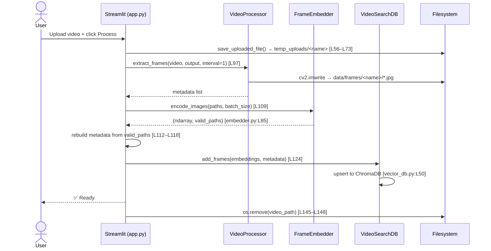
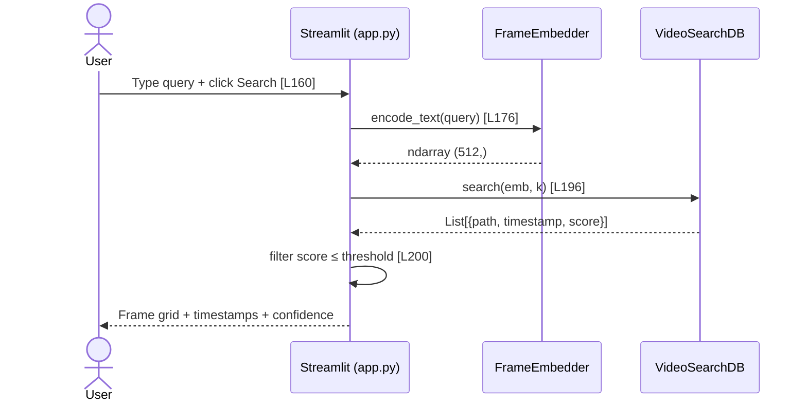
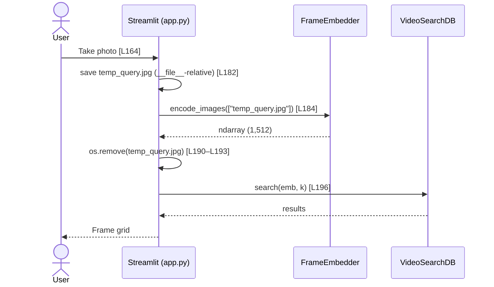

# V-RAG: Runtime Flows

> All steps backed by `file:line` evidence.

---

## 1. Ingestion (Upload → Index)

---

## 2. Text Search

---

## 3. Camera Search

---

## 4. Score Interpretation

`interpret_score()` — `app.py:L49–L51`:

| Score (L2) | Label | Color |
|---|---|---|
| < 135 | 🔥 High Confidence | green |
| 135–144 | ✅ Medium Confidence | orange |
| ≥ 145 | ⚠️ Low Confidence | red |
